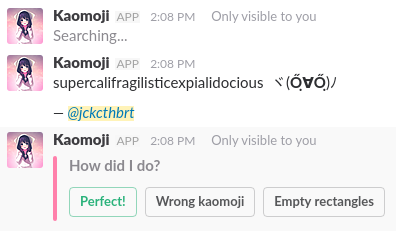

# kaomoji-bot 

Because why not? ┐(´∀｀)┌

  
*Example output*

---

## Usage (° o°)

`/kaomoji <feeling> [optional message]` - Send a kaomoji  
`/kaomoji help` - See usage information

---

### Important!! ( ⁰д⁰)

Not all of the characters are supported in all operating systems by default. There may also be limitations coming from Slack itself or your browser.

Mac and Windows have pretty good coverage out of the box, linux not-so-much. In my testing I that good coverage can come from installing the [Google Noto fonts](https://www.google.com/get/noto/):

* All Languages ([AUR package](https://www.archlinux.org/packages/extra/any/noto-fonts/))
* All CJK Fonts ([AUR Package](https://www.archlinux.org/packages/extra/any/noto-fonts-cjk/))

If you don't want to install all 470MB+ worth of Noto fonts, see the contents of the linked AUR packages for which ones to install. _(This is only tested under Arch Linux!)_

---

All the credit for creating and maintaining the awesome list of kaomoji this bot uses goes to [JapaneseEmoticons.me](http://japaneseemoticons.me/).

If you're into kaomoji please consider supporting them on Patreon, directly through PayPal, or by downloading their iOS and Android apps! w(°ｏ°)w

---

That's it (ﾟ´Д｀ﾟ)ﾟ
